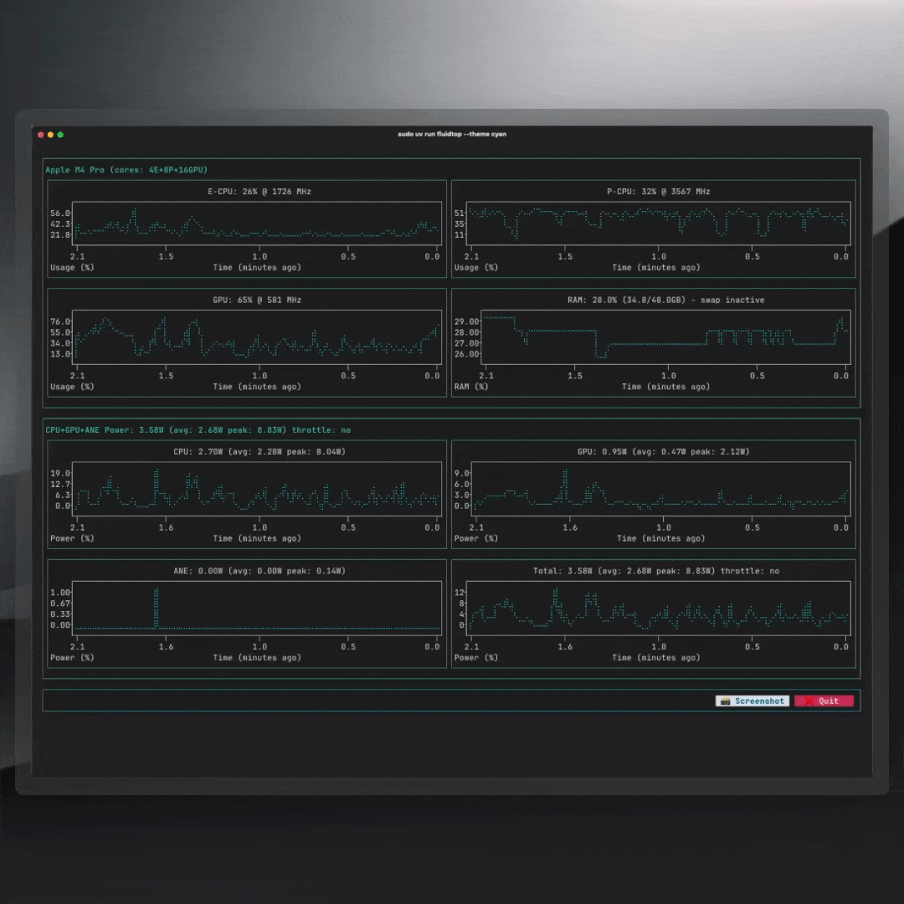
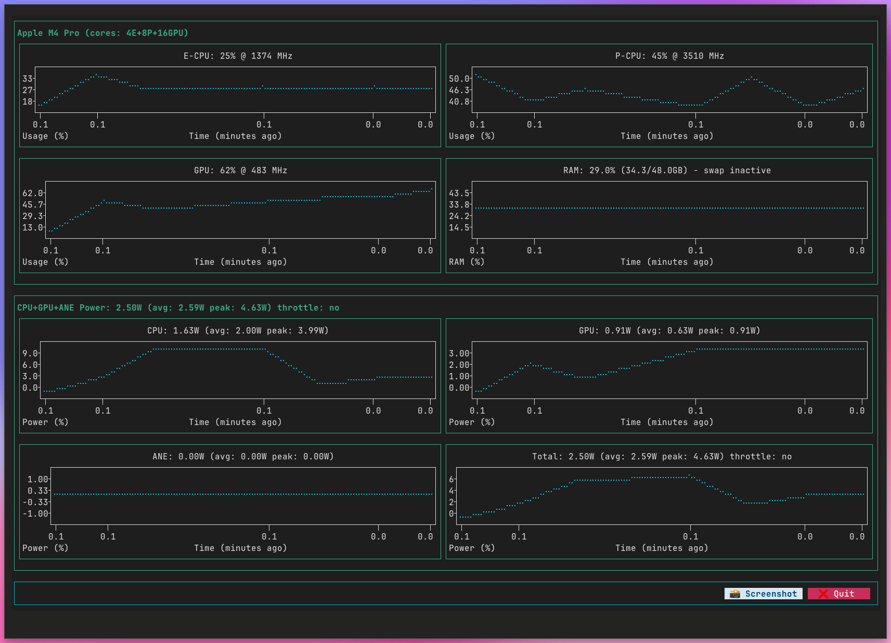

# fluidtop 

MacOS hardware performance monitoring CLI tool with a focus on AI Workloads

## What is `fluidtop`

A Python-based `nvtop`-inspired command line tool for Apple Silicon Macs (M1, M2, M3, M4+). This is an enhanced and actively maintained fork of the original [asitop](https://github.com/tlkh/asitop) project, with additional features and support for newer hardware. The original MIT license and commit history is preserved. 





### Key Features

* Easy install with `uv`
* Monitors CPU, GPU, and ANE usage in real time
* Shows RAM, swap, and (where available) memory bandwidth
* Tracks CPU/GPU power and detects thermal throttling
* Supports all Apple Silicon (M1–M4+), with Ghostty terminal optimization
* Individual core monitoring and future AI workload metrics

## Installation and Usage

### Quick Start with uv (Recommended)

```shell
# Install uv if not already installed
curl -LsSf https://astral.sh/uv/install.sh | sh

# Run directly without installation
sudo uv run fluidtop

# Run with options
sudo uv run fluidtop --interval 2 --color 5 --avg 60 --show_cores true
```


### Command Line Options

```shell
fluidtop [-h] [--interval INTERVAL] [--color COLOR] [--avg AVG] [--show_cores] [--max_count MAX_COUNT]

optional arguments:
  -h, --help           show this help message and exit
  --interval INTERVAL  Display and sampling interval for powermetrics (seconds, default: 1)
  --color COLOR        Choose display color theme (0-8, default: 2)
  --avg AVG            Averaging window for power values (seconds, default: 30)
  --show_cores         Enable individual core monitoring display
  --max_count          Restart powermetrics after N samples (for long-running sessions)
```

## How it works

`fluidtop` uses the built-in [`powermetrics`](https://www.unix.com/man-page/osx/1/powermetrics/) utility on macOS, which provides access to hardware performance counters. Root access is required due to `powermetrics` security requirements. The tool is lightweight with minimal performance impact.

**System Requirements:** Apple Silicon Macs running macOS Monterey (12.0) or later.

### Data Sources

* **CPU/GPU utilization:** `powermetrics` active residency measurements
* **Power consumption:** Energy counters from `powermetrics`
* **Memory usage:** [`psutil`](https://github.com/giampaolo/psutil) virtual memory statistics
* **System information:** `sysctl` for CPU details, `system_profiler` for GPU specs
* **Hardware specifications:** Built-in database with TDP and bandwidth specs for all Apple Silicon variants

## Attribution and Development

This project is a fork and continuation of the original [asitop](https://github.com/tlkh/asitop) by Timothy Liu, which appears to be no longer actively maintained. We extend our gratitude to the original author for creating this excellent foundation.

### Why fluidtop?

The original `asitop` project provided an excellent base for Apple Silicon monitoring, but lacked support for:
- Newer Apple Silicon chips (M3, M4+)
- Modern terminal emulators like Ghostty
- Enhanced monitoring capabilities for AI/ML workloads

`fluidtop` addresses these gaps while maintaining full compatibility with the original tool's functionality.

### Roadmap

- ✅ Enhanced hardware support (M1-M4+)
- ✅ Ghostty terminal optimization
- ✅ Improved user experience and documentation
- 🔄 Advanced AI workload monitoring
- 🔄 Custom monitoring profiles for different use cases
- 🔄 Export capabilities for performance data
- 🔄 Integration with popular ML frameworks

## Contributing

Issues:

- Need to make the chart height adapt to the height of the terminal, the width is fine but height doesn't change
- the color inside the plot isn't respecting the theme color


## License

MIT License - same as the original asitop project.

## Original Project

This project is based on [asitop](https://github.com/tlkh/asitop) by [Timothy Liu](https://github.com/tlkh). We thank the original author for their excellent work in creating the foundation for Apple Silicon performance monitoring.